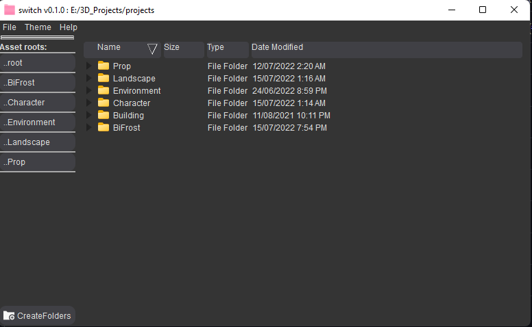
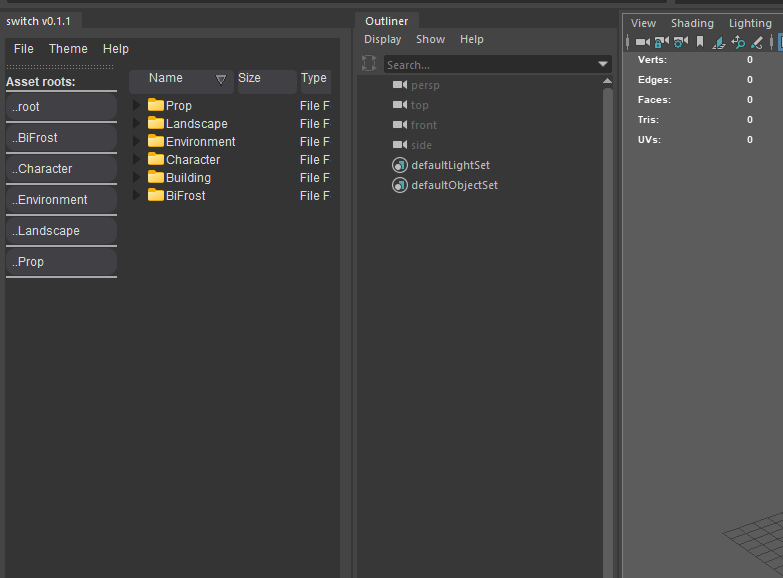
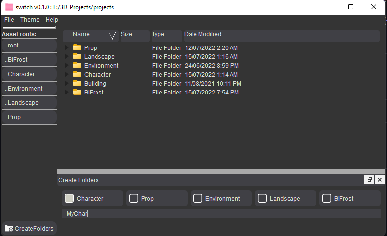
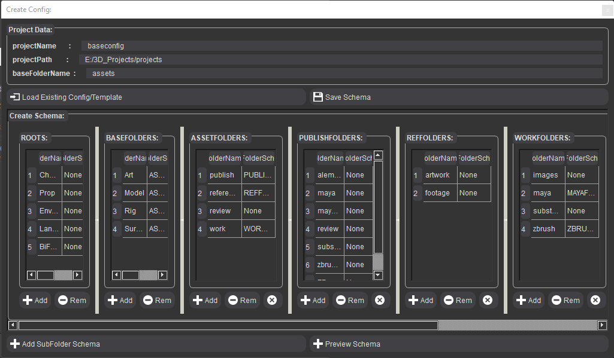
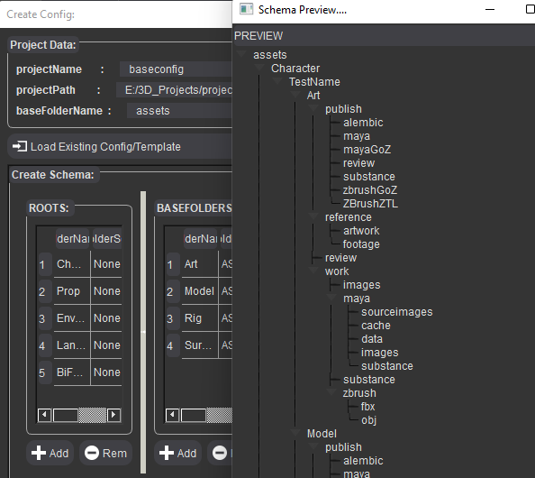
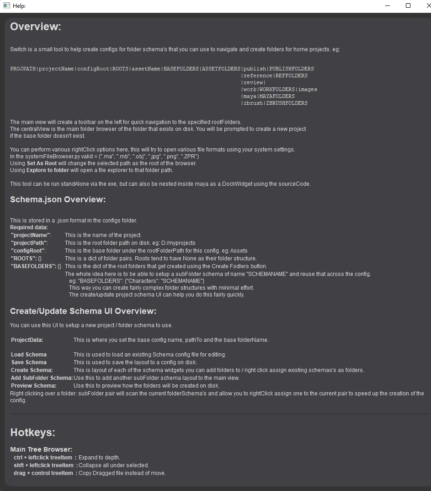

# switch
Small folder Windows folder management system for projects at home. Runs as a dockWidget inside maya and as <br>
standalone if you compile using py2exe (see below)...

## Maya
Run the following inside Maya to create a dockable dockWidget.

````
import sys
import importlib
path = "D:\\CODE\\Python\\jamesd\\switch"
if path not in sys.path:
    sys.path.append(path)

from switch import switch as switch
importlib.reload(switch)
switch.run()
````
____

## Making standalone switch.exe  
````
python setup.py py2exe
````
From the commandline inside the switch folder run the above command.<br> 
This will build into the dist folder and you can run the switch.exe from there.

____

Screenshots
-----------

The main UI<br>


Inside Maya<br>


Adding folders using the createFolders button<br>


The config editor to quickly make the json files for the folder schema to use.<br>


Previewing the folders<br>


The help widget<br>

