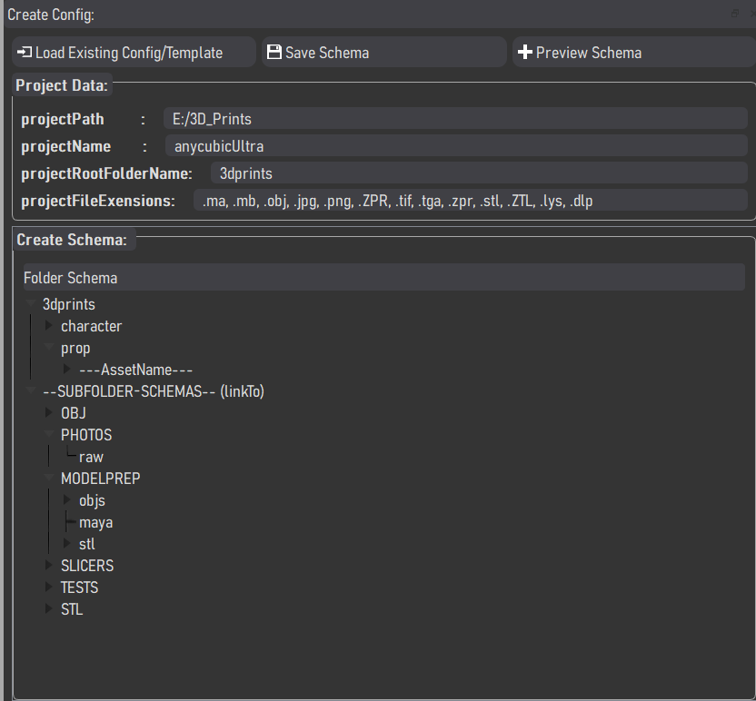
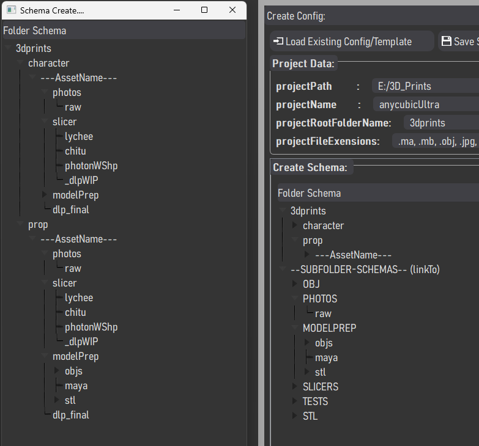

# switch
Small folder management system for windows projects at home

## Maya
Run the following inside Maya to create a dockable dockWidget.

````
import sys
import importlib
path = "D:\\CODE\\Python\\jamesd\\switch"
if path not in sys.path:
    sys.path.append(path)

from switch import switch as switch
importlib.reload(switch)
switch.run()
````

##Making standalone exe use 
````
python setup.py py2exe
````
in the switch folder. This will build into the dist folder.
Requirements will be valid paths for
````
('imageformats', [r'C:\Python\Python310\Lib\site-packages\PyQt5\Qt5\plugins\imageformats\qico.dll']),

('platforms', [r'C:\Python\Python310\Lib\site-packages\PyQt5\Qt5\plugins\platforms\qwindows.dll']),
````

Screenshots
-----------

The main UI<br>


Adding folders using the createFolders button<br>


The config editor to quickly make the json files for the folder schema to use.<br>


Previewing the folders<br>


The help widget<br>

